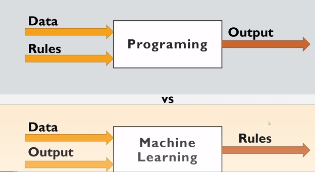

# Programming-VS-ML
# Programming vs. Machine Learning
## Programming
>Programming involves creating explicit, step-by-step instructions, requires anticipating(متوقع) all possible scenarios
## Machine learning
>enables computers to learn and improve from data machine learning can identify patterns and make predictions without pre-programmed rules Machine learning is a subfield of artificial intelligence, which focuses on building computer systems that can learn and improve from data.
---

***Learn By Visualization***


The  Video link Traditional programming  vs ML [Here](https://youtu.be/6AlfcbhgBvo?si=b0knwmnK3NsK8h12)

### Traditional Programming
```python
def add_numbers(a, b):
    # Explicitly define the addition operation
    result = a + b
    return result

# Call the function with specific numbers
num1 = 5
num2 = 3
sum = add_numbers(num1, num2)
print("The sum is:", sum)

```
### Machine Learning
```python
from sklearn import svm

# Training data: heights and weights with corresponding labels (tall or short)
X = [[170, 70], [180, 75], [160, 60], [165, 65]]
y = ['tall', 'tall', 'short', 'short']

# Create and train a Support Vector Machine (SVM) model
clf = svm.SVC()
clf.fit(X, y)

# Predict the label for a new data point
new_data = [[175, 72]]
prediction = clf.predict(new_data)
print("Prediction:", prediction)

```
| tall | short |
|---|:----:|
|170|70|
|180|75|
|160|60|
|165|65|

For Further detail please read This  [Defintation](#machine-learning) and watch [video](https://youtu.be/6AlfcbhgBvo?si=b0knwmnK3NsK8h12)
